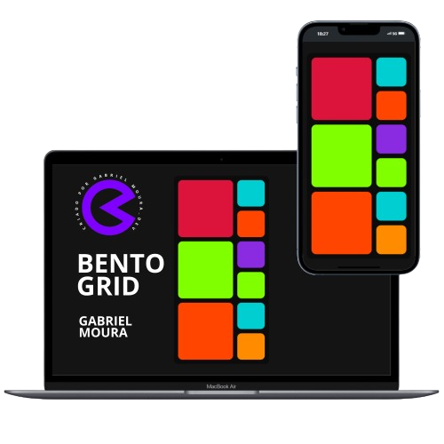

# GM Developer │ BENTO-GRID

# Imagem do Projeto

Demonstra minha abordagem ao desenvolvimento web, focando em design responsivo, interatividade e experiências de usuário otimizadas.

## Tecnologias e Ferramentas

Foi construído utilizando...
- **HTML & CSS**: Estruturação e estilização responsiva do PROJETO.

### Design e Usabilidade

- **Design Responsivo**: Totalmente adaptável a diferentes tamanhos de tela, garantindo uma experiência de usuário consistente em dispositivos móveis e desktops.

### Funcionalidades

Sistemas de Grid em Programação Web
Os sistemas de grid são amplamente utilizados no design de interfaces web para organizar o conteúdo de forma ordenada e responsiva.

